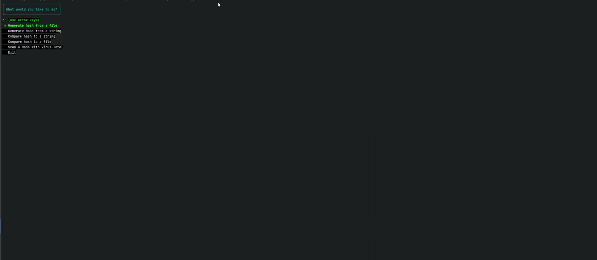
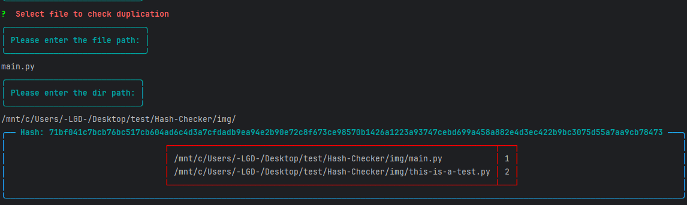

<p align="center">
    
</p>


- This is a command-line interface (CLI) tool designed to check the integrity of files and generate hashes. 
- It also allows you to scan hashes using the VirusTotal API and get report back.
- Finaly you can check about duplicate file from a hash file or just investigating a specific directory.

## What is a hash, and what is it for? :

A hash is a fixed-length string generated by a hash function that uniquely represents the contents of a file or data. 
Hashes are commonly used to verify data integrity, ensure files haven't been tampered with, and quickly compare large datasets.
In the context of files, hashing helps confirm that a file remains unchanged or authentic.<br>


## Some uses of hashing :

| **Use Case**               | **Description**                                                                 |
|----------------------------|---------------------------------------------------------------------------------|
| **File integrity verification** | Check if files have been altered or corrupted by comparing their hashes before and after transfer or storage. |
| **Password storage**       | Store hashed versions of passwords to enhance security.                        |
| **Digital signatures**     | Verify the authenticity and integrity of digital documents.                    |
| **Duplicate detection**    | Identify duplicate files or data by comparing their hashes.                   |
| **Security checks**        | Scan hashes against databases (like VirusTotal) to detect malicious or known compromised files. |

--------------------

## This project :

Is a simple CLI tool that allows to : 

- Generate hash from a file
- Generate hash from a string
- Compare hash to a string
- Compare hash to a file
- Scan a Hash with Virus-Total
- Select file to check duplication
- Global check directories for Duplicate Files


*- it handle 16 algorithm that are commonly used for this task*

<p align="center">
    
</p>


## Report and History : 

### Virus Total : 

- You will need to create an account on [VIRUS_TOTAL](https://www.virustotal.com/gui/sign-in) to get a free API Key, 
and be able to use `Scan a Hash with Virus-Total` feature 

- In the current directory where you execute this tool, you will have a `.file_path_history` that help 
auto-complete of dir path to be more accurate

- After getting the report in console, a `report_{hash_numer}.html` is also available in the current dir  

### Duplication Check : 

- a report formated like `scan_report_06-06-2025--14-40-33.txt` will appear in the current directory where you execute this tool


----------


## Installation : 


- This project runs on Python 3.12.3


- Clone the project:
```bash
    git clone https://github.com/LGD-P/Hash-Checker.git
```

- Go in current dir : 
```bash
    cd Hash-Checker
```

- If not already installed:
```bash
    pip3 install poetry
```
- Activate the environment:
```bash
    poetry shell
```

- Install dependencies:
```bash
    poetry install
```

- Env file and API KEY 
```bash
echo 'VT_API_KEY="your_key"' > .env
```

----------


## Illustration : 
<p align="center">
Generate hashes from a file :
</p>
 

<p align="center">
    
</p>

<p align="center">
Generate hashes from a String :
</p>

<p align="center">
    
</p>

<p align="center">
Send Suspicious Hash to Virus Total Api and get report back :
</p>

<p align="center">
    
</p>

<p align="center">
Check for duplicate Files : 
</p>

<p align="center">
    
</p>

---------

#### More about Hashes ? 

-  You should learn about Hash Collisions and understand why MD5 and SHA-1 are not recommended.
-  [HashList](https://hashcat.net/wiki/doku.php?id=example_hashes)
-  [JohnTheRipper](https://www.kali.org/tools/john/)
-  [HashCatTool](https://www.kali.org/tools/hashcat/)
