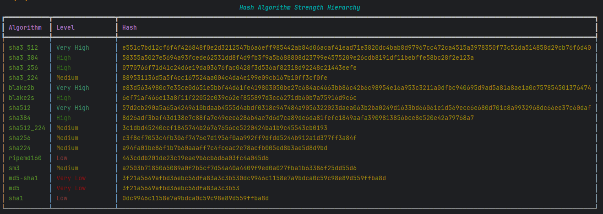

    

# Hash-Checker

This is a command-line interface (CLI) tool designed to check the integrity of files and generate hashes. 
It also allows you to scan hashes using the VirusTotal API.

## What is a hash, and what is it for? :

A hash is a fixed-length string generated by a hash function that uniquely represents the contents of a file or data. 
Hashes are commonly used to verify data integrity, ensure files haven't been tampered with, and quickly compare large datasets.
In the context of files, hashing helps confirm that a file remains unchanged or authentic. 

## Some uses of hashing :

- **File integrity verification:** Check if files have been altered or corrupted by comparing their hashes before and after transfer or storage.
- **Password storage:** Store hashed versions of passwords to enhance security.
- **Digital signatures:** Verify the authenticity and integrity of digital documents.
- **Duplicate detection:** Identify duplicate files or data by comparing their hashes.
- **Security checks:** Scan hashes against databases (like VirusTotal) to detect malicious or known compromised files.

## This project :

Is a simple CLI tool that allows to : 

- Generate hash from a file
- Generate hash from a string
- Compare hash to a string
- Compare hash to a file
- Scan a Hash with Virus-Total

it handles 16 algorithm that are commonly used for this task

    

You want more ? -> [HashCat](https://hashcat.net/wiki/doku.php?id=example_hashes)

### Compare or Generate hash from or to file : 

- If you use compare or generate function for file, a `.file_path_history` will be created in your current directory to help you search next time.

## Install project:

### Clone project:

    git clone https://github.com/LGD-P/Hash-Checker.git
    cd Hash-Checker

### Install Poetry dependency management:

    pip install poetry

### Active virtual environnement in your project:

    poetry shell

### Install dependencies:

    poetry install

### Run project in you IDE:

    python main.py

### Scan a Hash with VirusTotal

- If you want to use this feature, you will need to create a .env file and add your VT_API_KEY.
- Create an account to get a free API key from [VIRUS TOTAL](https://www.virustotal.com/gui/home/upload).
- This project only sends file hashes to the API. I recommend not uploading personal files directly to the app, except when using the private scanning mode, which is a premium feature.

## Illustration : 

    Generate a hash from a file and submit it to VIRUS TOTAL API

    

 
